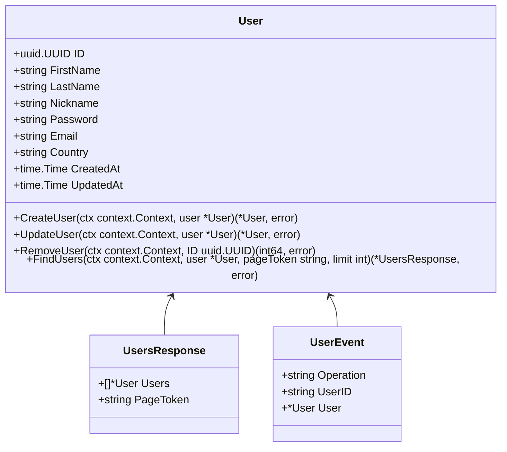
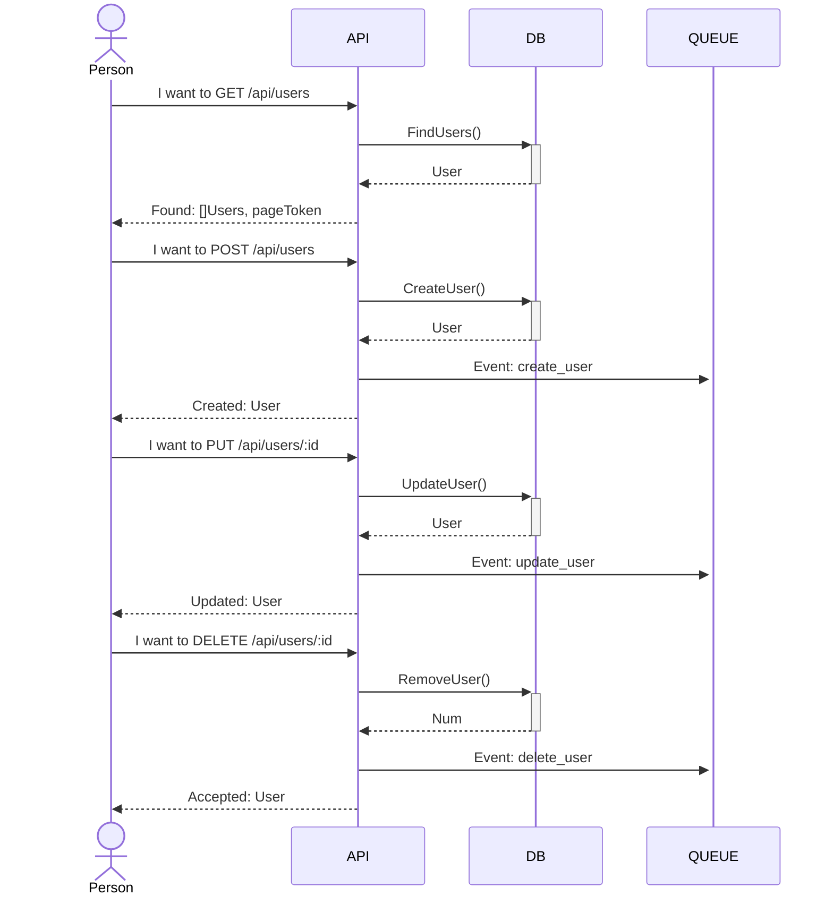

# MANAGE_USER_GO_PG_ECHO

This is a simple service to manage users.

## Class Diagrams:


## Sequence Diagrams:


## How to run:
#### External dependencies
* Postgres (required)
* RabbitMQ (required)

To run the unity-tests no dependencies are needed, so just run the command below from inside the project folder:
```sh
go test -v ./...
```

To run the service after setting the dependencies in the .env just run:
```sh
go run ./cmd/api/main.go
```

If any changes were made in the models you will need to re-generate the interfaces mocks via [mockgen](https://github.com/golang/mock). For that just run:
```sh
go generate ./...
```

### Docker-compose:
In order to just run the service, if you have [docker](https://docs.docker.com/desktop/) and [docker-compose](https://docs.docker.com/compose/install/) (version 1.25.0 or higher) you may just execute the commands from within the project after any changes:
```sh
docker-compose build
docker-compose up
```
The Service must be up and running with all dependencies.

Obs.: The Go service may fail and restart a few times During initialization because RabbitMQ takes a few seconds to start, but once Rabbit is up the Go service will connect quickly and show the Echo init message. After that you should be able to call the APIs:

## Request Examples:

### Create User:
#### Request:
```sh
curl --location --request POST 'http://localhost:3000/api/users' \
--header 'Content-Type: application/json' \
--data-raw '{
    "first_name":"Jacinto",
    "last_name":"Pinto",
    "nickname":"JP",
    "password":"ABC123!",
    "email":"jacinto.pinto@email.com",
    "country":"JM"
}'
```
#### Response: 
HttpStatus: 201 Created
```json
{
    "id": "31b0dea1-896d-4ce2-b1d4-9cb3a0be25e7",
    "first_name": "Jacinto",
    "last_name": "Pinto",
    "nickname": "JP",
    "email": "jacinto.pinto@email.com",
    "country": "JM",
    "created_at": "2022-10-09T16:25:03.214561Z",
    "updated_at": "2022-10-09T16:25:03.214561Z"
}
```
Obs.: Password hidden for safety concerns
### Update User:
#### Request:
```sh
curl --location --request PUT 'http://localhost:3000/api/users/bec30bd2-0a60-4609-8271-d74cd206a7ed' \
--header 'Content-Type: application/json' \
--data-raw '{
    "id": "bec30bd2-0a60-4609-8271-d74cd206a7ed",
    "first_name": "Oitavo",
    "last_name": "Segundo",
    "nickname": "OS",
    "password": "ABC1234!",
    "email": "oitavo.segundo@email.com",
    "country": "CA"
}'
```
#### Response:
HttpStatus: 200 Ok
```json
{
    "id": "bec30bd2-0a60-4609-8271-d74cd206a7ed",
    "first_name": "Oitavo",
    "last_name": "Segundo",
    "nickname": "JD",
    "email": "oitavo.segundo@email.com",
    "country": "BR",
    "created_at": "2022-10-09T14:42:34.983604Z",
    "updated_at": "2022-10-09T14:43:16.289308Z"
}
```
Obs.: Password hidden for safety concerns

### Remove User:
#### Request:
```sh
curl --location --request DELETE 'http://localhost:3000/api/users/bec30bd2-0a60-4609-8271-d74cd206a7ed'
```
#### Response:
HttpStatus: 202 Accepted

### Find User:
#### Request:
```sh
curl --location --request GET 'http://localhost:3000/api/users?country=JM&limit=1&page_token=NDc2Nzg5NjctMzQ2ZS00NmJlLWI1ZGEtMGVhZDNlMDgwYzc0'
```
#### Response:
HttpStatus: 200 Ok
```json
{
    "users": [
        {
            "id": "47678967-346e-46be-b5da-0ead3e080c74",
            "first_name": "Jacinto",
            "last_name": "Pinto",
            "nickname": "JP",
            "email": "jacinto.pinto@email.com",
            "country": "JM",
            "created_at": "2022-10-09T16:24:51.255769Z",
            "updated_at": "2022-10-09T16:24:51.255769Z"
        }
    ],
    "page_token": "ZjJmNDdmYTktNjk3Yy00YTY5LWJhZmQtZmU2ZmFjNjNkZjk5"
}
```
Obs.: Password hidden for safety concerns

