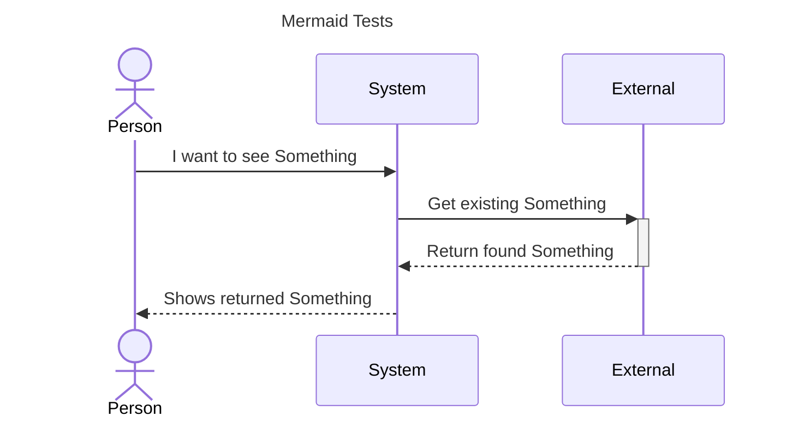

# go-echo-blueprint
This project has the object to serve as a blueprint experimentation for new microservices.

```mermaid
sequenceDiagram
    title Mermaid Tests
    actor Person
    participant System
    participant External

    Person->>System: I want to see Something
    System->>+External: Get existing Something
    External-->>-System: Return found Something
    System-->>Person: Shows returned Something
```

check test healthz folder organization

