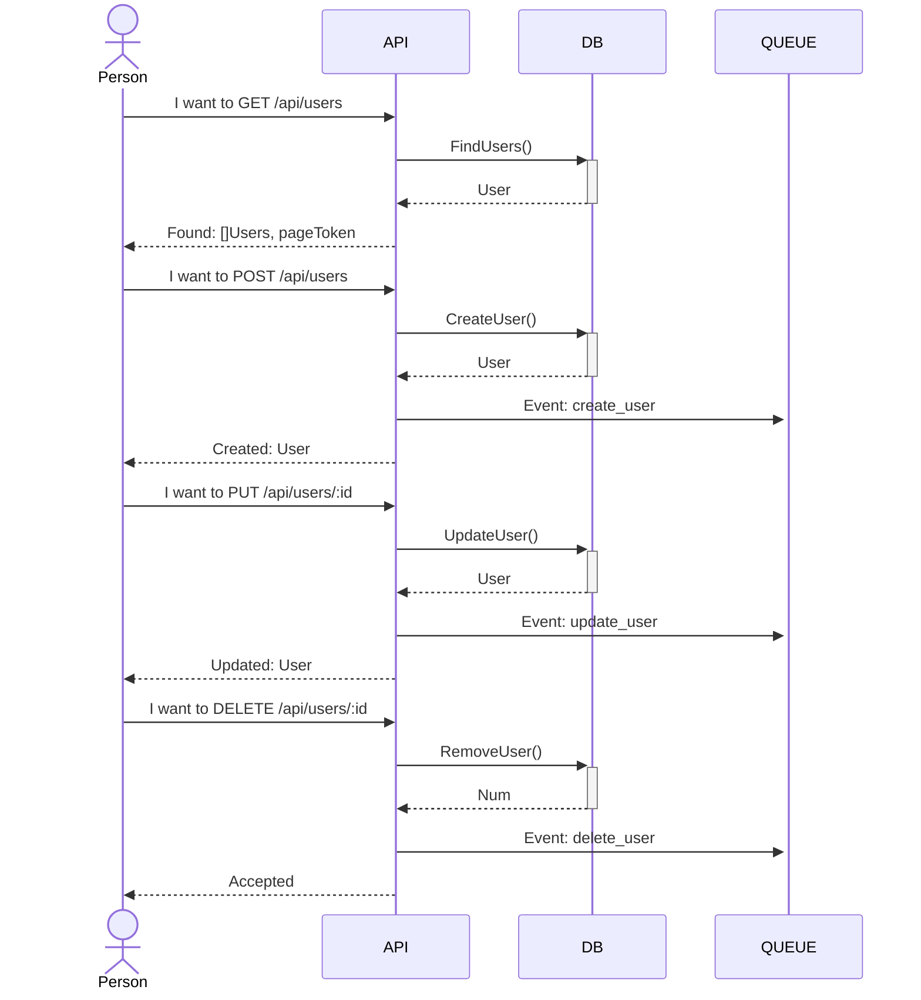

# MANAGE_USER_GO_PG_ECHO

This is a simple service to manage users in a Postgres DB while the changes are being broadcasted to a RabbitMQ service asynchronously.

The service must allow you to:
- [x] Add a new User
- [x] Modify an existing User
    - It was assumed a PUT method that replaces the entire User attributes, not PATCH.
- [x] Remove a User
- [x] Return a paginated list of Users, allowing for filtering by certain criteria (e.g. all Users with the country "UK")
    - As the pagination method wasn't specified I've chosen the `nextPageToken` pagination that is the simplest and fastest I know.
    - None of User response body are returning the password field for safety concerns.

The service must:
- [x] Provide an HTTP or gRPC API
    - HTTP only, using [Echo](https://echo.labstack.com/) web framework
- [x] Use a sensible storage mechanism for the Users
    - I've chosen a [PostgresDB](https://www.postgresql.org/)
    - There is not being used any SQL generator as the project just use simple CRUD operations.
- [x] Have the ability to notify other interested services of changes to User entities
    - I've chosen the [RabbitMQ](https://www.rabbitmq.com/) to broadcast the entity changes sent events.
    - The messages are being triggered as soon as the DB persists the data successfully but no additional checks are being made after the message is dispatched, (May need improvements for critical operations).
- [x] Have meaningful logs
    - I've chosen [Zap logger](https://pkg.go.dev/go.uber.org/zap). 
- [x] Be well documented
    - I hope to be providing lot's of detais in this README.md and also in the code.
- [x] Have a health check
    - The health check is checking if all connections are alive.

## Class Diagrams:


## Sequence Diagrams:


## How to run:
#### External dependencies
* Postgres (required)
* RabbitMQ (required)

To run the unity-tests no dependencies are needed, so just run the command below from inside the project folder:
```sh
go test -v ./...
```

To run the service after setting the dependencies in the .env just run:
```sh
go run ./cmd/api/main.go
```

If any changes were made in the models you will need to re-generate the interfaces mocks via [mockgen](https://github.com/golang/mock). For that just run:
```sh
go generate ./...
```

### Docker-compose:
In order to just run the service, if you have [docker](https://docs.docker.com/desktop/) and [docker-compose](https://docs.docker.com/compose/install/) (version 1.25.0 or higher) you may just execute the commands from within the project after any changes:
```sh
docker-compose build
docker-compose up
```
The Service must be up and running with all dependencies.

Obs.: The Go service may fail and restart a few times During initialization because RabbitMQ takes a few seconds to start, but once Rabbit is up the Go service will connect quickly and show the Echo init message. After that you should be able to call the APIs:

## Request Examples:

### Healthz:
#### Request:
```sh
curl --request GET 'http://localhost:3000/api/healthz'
```
#### Response:
HttpStatus: 204 No Content

### Create User:
#### Request:
```sh
curl --request POST 'http://localhost:3000/api/users' \
--header 'Content-Type: application/json' \
--data-raw '{
    "first_name":"Jacinto",
    "last_name":"Pinto",
    "nickname":"JP",
    "password":"ABC123!",
    "email":"jacinto.pinto@email.com",
    "country":"JM"
}'
```
#### Response: 
HttpStatus: 201 Created
```json
{
    "id": "31b0dea1-896d-4ce2-b1d4-9cb3a0be25e7",
    "first_name": "Jacinto",
    "last_name": "Pinto",
    "nickname": "JP",
    "email": "jacinto.pinto@email.com",
    "country": "JM",
    "created_at": "2022-10-09T16:25:03.214561Z",
    "updated_at": "2022-10-09T16:25:03.214561Z"
}
```
Obs.: Password hidden from responses for safety concerns
### Update User:
#### Request:
```sh
curl --request PUT 'http://localhost:3000/api/users/bec30bd2-0a60-4609-8271-d74cd206a7ed' \
--header 'Content-Type: application/json' \
--data-raw '{
    "id": "bec30bd2-0a60-4609-8271-d74cd206a7ed",
    "first_name": "Oitavo",
    "last_name": "Segundo",
    "nickname": "OS",
    "password": "ABC1234!",
    "email": "oitavo.segundo@email.com",
    "country": "CA"
}'
```
#### Response:
HttpStatus: 200 Ok
```json
{
    "id": "bec30bd2-0a60-4609-8271-d74cd206a7ed",
    "first_name": "Oitavo",
    "last_name": "Segundo",
    "nickname": "JD",
    "email": "oitavo.segundo@email.com",
    "country": "BR",
    "created_at": "2022-10-09T14:42:34.983604Z",
    "updated_at": "2022-10-09T14:43:16.289308Z"
}
```
Obs.: Password hidden from responses for safety concerns

### Remove User:
#### Request:
```sh
curl --request DELETE 'http://localhost:3000/api/users/bec30bd2-0a60-4609-8271-d74cd206a7ed'
```
#### Response:
HttpStatus: 202 Accepted

### Find User:
#### Request:
```sh
curl --request GET 'http://localhost:3000/api/users?country=JM&limit=1&page_token=NDc2Nzg5NjctMzQ2ZS00NmJlLWI1ZGEtMGVhZDNlMDgwYzc0'
```
#### Response:
HttpStatus: 200 Ok
```json
{
    "users": [
        {
            "id": "47678967-346e-46be-b5da-0ead3e080c74",
            "first_name": "Jacinto",
            "last_name": "Pinto",
            "nickname": "JP",
            "email": "jacinto.pinto@email.com",
            "country": "JM",
            "created_at": "2022-10-09T16:24:51.255769Z",
            "updated_at": "2022-10-09T16:24:51.255769Z"
        }
    ],
    "page_token": "ZjJmNDdmYTktNjk3Yy00YTY5LWJhZmQtZmU2ZmFjNjNkZjk5"
}
```
Obs.: Password hidden from responses for safety concerns

## Next steps
- [ ] Improve migrations system. The current one is just designed to Create a new schema and a table. I would need a precise control of versions transactions and rollbacks. 
- [ ] Improve events system. Currently I don't validate the integration success so any critical update may be lost if there is a sending problem. 
- [ ] DB transactions also would need to be included if I want to sync it with the event sending.
- [ ] The docker-compose.yaml is very simple and there is not a wait-for-readiness, so the service will just keep being restarted until RabbitMQ and PostgresDB are ready. 
- [ ] The User model is being shared by the API and Repository. Ideally should have one for each.
- [ ] Ideally for more complex queries I could use [SQL generator for Go](https://github.com/Masterminds/squirrel).
- [ ] The Graceful-Shutdown is basically inexistent and should be implemented.
- [ ] More Unity tests can be added to improve the coverage, and also Functional tests that are non existent right now.
- [ ] A robust authentication system.
